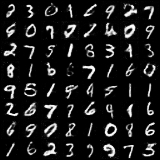
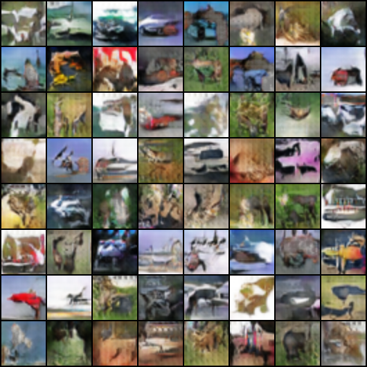

# PyTorch GANs


A collection of **Generative Adversarial Networks (GANs)** implemented in **PyTorch**.  
This repository brings together different GAN architectures trained on benchmark datasets, providing a practical and extensible framework for learning and experimentation.  

The implementations are designed to be:  
- **Educational** → Clean code that highlights the fundamentals of adversarial training.  
- **Extensible** → Modular design to adapt to new architectures or datasets.  
- **Reproducible** → Includes notebooks, checkpoints, and sample outputs for transparency.   

---


## 📂 Repository Structure

```plaintext
pytorch-gans/
│
├── mnist_gan/             # Baseline GAN on MNIST (32x32 grayscale)
│   ├── training/             # Jupyter notebooks for training & visualization
│   ├── samples/              # Generated digit samples
│   └── src/                  # Source code (data, models, training loop)
│
├── dcgan_cifar/            # Deep Convolutional GAN on CIFAR-10 (32x32 RGB)
│   ├── model/                # Saved models (weights, checkpoints)
│   ├── training/             # Training & visualization notebooks
│   ├── samples/              # Generated CIFAR-10 images
│   └── src/                  # Source code (data, DCGAN models, training loop)
│
├── hinge_sngan/            # Hinge-SNGAN with R1, EMA, DiffAugment (CIFRAR-10, 64x64 RGB)
│   ├── samples_first_training/   # Generated samples from first training run
│   ├── samples_second_training/  # Generated samples from second training run
│   └── src/                      # Core implementation (losses, models, train loop)
│   └── training/                 # Training model notebooks 
│
├── LICENSE                    # MIT License
├── pyproject.toml             # Project metadata (Poetry / pip installation)
├── poetry.lock                # Dependency lockfile
└── README.md                  # Project documentation

# Every model has a gan_full.ipynb with all the functions and training loops in one place
```

---

### 1. **MNIST GAN** (`mnist_gan/`)
A fully connected GAN trained on the **MNIST dataset** to generate realistic handwritten digits.  

- **Generator**: maps latent vectors (*z* ∈ ℝ^100) to grayscale images of size 32×32.  
- **Discriminator**: distinguishes between real MNIST digits and generated samples.  
- Serves as the **baseline** implementation, ideal for understanding the core mechanics of GANs.  

<p align="center">
  
</p>

---

### 2. **Deep Convolutional GAN (DCGAN)** (`dcgan_cifar/`)
A convolutional GAN based on the **DCGAN architecture** (Radford et al., 2015), trained on the **CIFAR-10 dataset**.  

- **Generator**: convolutional layers with transposed convolutions, enabling the synthesis of 32×32 **color images**.  
- **Discriminator**: convolutional classifier distinguishing real vs. fake images.  
- Incorporates training refinements such as **two-step generator updates** to stabilize learning.  

<p align="center">
  
</p>

---

### 3. **Hinge-SNGAN (CIFRAR)** (`hinge_sngan/`)
A modern GAN variant combining **Spectral Normalization (SN)**, **Hinge Loss**, **R1 regularization**, **Exponential Moving Average (EMA)**, and **DiffAugment**.  

- **Generator**: maps latent vectors (*z* ∈ ℝ^100) into 64×64×3 RGB images.  
- **Discriminator**: convolutional network with **spectral normalization** for stable training and margin-based hinge loss.  
- **Training features**:  
  - Multiple discriminator steps per generator update.  
  - Warm-up phase with extra generator training.  
  - **R1 penalty** every N steps to regularize gradients.  
  - **EMA** to smooth generator updates.  
  - **DiffAugment** for improved performance on small datasets.  

<p align="center">
  
</p>


---

# ⚙️ Installation & Dependencies

## 1. Clone the repository
```bash
git clone https://github.com/pablo-reyes8/pytorch-gans.git
cd pytorch-gans
```

## 2. Create a virtual environment (recommended)
```bash
python -m venv venv
source venv/bin/activate   # On Linux/Mac
venv\Scripts\activate      # On Windows
```

## 3. Install dependencies

```bash
poetry install
```


---

## 📚 References

- Ian Goodfellow et al. (2014). *Generative Adversarial Nets*. NeurIPS.  
- Alec Radford, Luke Metz, Soumith Chintala (2015). *Unsupervised Representation Learning with Deep Convolutional Generative Adversarial Networks (DCGAN)*.  
- Takeru Miyato et al. (2018). *Spectral Normalization for Generative Adversarial Networks*. ICLR.  
- Lars Mescheder, Andreas Geiger, Sebastian Nowozin (2018). *Which Training Methods for GANs do actually Converge?* ICML.  
- Tero Karras, Samuli Laine, Timo Aila (2019). *A Style-Based Generator Architecture for Generative Adversarial Networks (StyleGAN)*. CVPR.  
- Shengyu Zhao, Zhijian Liu, Ji Lin, Jun-Yan Zhu, Song Han (2020). *Differentiable Augmentation for Data-Efficient GAN Training*. NeurIPS.  
- PyTorch Documentation: [https://pytorch.org/docs/stable/](https://pytorch.org/docs/stable/) 

---

## 📜 License

This project is licensed under the **MIT License** – see the [LICENSE](LICENSE) file for details.

---

## ✨ Future Work

- Implement **Wasserstein GANs (WGAN, WGAN-GP, WGAN-div)** for improved training stability.  
- Scale up to larger and higher-resolution datasets (e.g., **CelebA-HQ**, **LSUN Bedrooms**).  
- Incorporate backbones of advanced architectures such as **BigGAN** or **StyleGAN2/3**.  
- Explore **conditional GANs (cGANs, AC-GAN, Projection GANs)** for class-conditioned or multi-label generation.  
- Extend augmentation pipeline with **DiffAugment variants** and modern techniques (e.g., ADA from StyleGAN2).  

