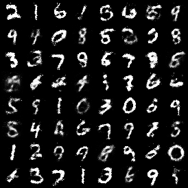

# MNIST - Generative Adversarial Network


An implementation of a **Generative Adversarial Network (GAN)** in PyTorch, trained on the MNIST dataset to generate realistic handwritten digits.  
This repository demonstrates the core principles of adversarial training through a clean and well-structured codebase, making it both a practical learning resource and a solid foundation for extending towards more advanced GAN architectures.


---

## 📂 Project Structure

```plaintext
├── samples/ # Generated images during training
├── gan-model/ # Core GAN implementation
│ ├── gan_full.ipynb # End-to-end notebook: training + visualization
│ ├── load_data.py # Data loading utilities (MNIST, transforms, DataLoader)
│ ├── model.py # Generator and Discriminator model definitions
│ ├── train_model.ipynb # Training workflow (notebook version)
│ ├── training.py # Training loop implementation with logging and sampling
```

---

## ⚙️ Main Components

- **`model.py`**  
  Defines the **Generator** and **Discriminator** networks using `torch.nn.Module`.  
  - Generator: maps latent vectors (z ∈ ℝ^100) to 32×32 grayscale images.  
  - Discriminator: classifies images as real (from MNIST) or fake (from the generator).  

- **`training.py`**  
  Contains the training loop for the GAN. Handles forward/backward passes, optimizer steps, and periodic image sampling for monitoring progress.  

- **`load_data.py`**  
  Loads and preprocesses the MNIST dataset, applying normalization and batching for training.  

- **`gan_full.ipynb`**  
  Jupyter Notebook that ties together the data, models, and training loop in one interactive script. Ideal for experimenting and visualizing results.  

- **`train_model.ipynb`**  
  Focused notebook for running the training pipeline with logging of loss values and generated samples.  

- **`samples/`**  
  Stores generated images at different epochs, allowing visualization of the GAN’s learning progress.  

---

## 🚀 Results

After training for ~20 epochs, the generator produces recognizable handwritten digits. With more epochs and training tricks (e.g., label smoothing, improved architectures), the results can be significantly improved.  

<p align="center">
  
</p>


---

## Requirements

```bash
pip install torch torchvision matplotlib
```
  
---

## 📚 References

- Ian Goodfellow et al. (2014). *Generative Adversarial Nets*. NeurIPS.  
- Alec Radford, Luke Metz, Soumith Chintala (2015). *Unsupervised Representation Learning with Deep Convolutional Generative Adversarial Networks (DCGAN)*.  
- PyTorch Documentation: [https://pytorch.org/docs/stable/](https://pytorch.org/docs/stable/)

---

## 📜 License

This project is licensed under the **MIT License** – see the [LICENSE](LICENSE) file for details.

---

## ✨ Future Work

- Experiment with **Wasserstein GAN (WGAN)** and gradient penalty.  
- Extend to **color datasets** like CIFAR-10.  
- Add logging and visualization with **TensorBoard**.  
- Explore **conditional GANs (cGANs)** for class-conditioned digit generation.

