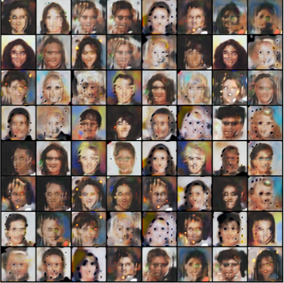

# 🎨 StyleGAN – CelebA 64×64

 
 
 
 
 


An implementation of the original **StyleGAN (Karras et al. 2019)**, trained on **CelebA (64×64)**.  
This project reproduces the key ideas of the _style-based generator architecture_ and integrates features such as **style mixing**, **per-layer noise injection**, and **Exponential Moving Average (EMA)** for stable training.

---

## 📂 Project Structure

```plaintext
stylegan/
├── samples/                   # Generated samples from multiple runs
│   ├── epoch_0005.png
│   ├── epoch_0020.png
│   └── ...
├── src/                       # Core implementation
│   ├── data/                  # Custom CelebA dataloaders (zip / torchvision)
│   │   ├── load_data_from_torch.py
│   │   └── load_data_local.py
│   ├── model/                 # StyleGAN components
│   │   ├── generator.py
│   │   ├── discriminator.py
│   │   ├── mapping_network.py
│   │   └── synthesis_network.py
│   ├── training/              # Training loop
│   │   └── loop_stylegan.py
│   └── utils/                 # Helper functions
│       ├── loss_utils.py
│       └── training_utils.py
├── testing/                   # Unit tests
│   └── tests_data.py
└── training/                  # Notebooks for experimentation
    ├── StyleGan.ipynb
    └── StyleGan_full.ipynb
```

---

## ⚙️ Main Components

- **Mapping Network**  
  Transforms latent vectors \(z \sim \mathcal{N}(0, I)\) into a disentangled latent space \(w\).

- **Synthesis Network**  
  Starts from a learned constant and applies modulated convolutions to generate images.  
  Includes:

  - **AdaIN (Adaptive Instance Normalization)** for style injection.
  - **Stochastic noise inputs** for fine details (e.g., hair, freckles).
  - **Style mixing** to improve disentanglement.

- **Discriminator**  
  CNN classifier distinguishing real from generated images.

- **Training Features**
  - Hinge or logistic adversarial losses.
  - EMA of generator weights for stable evaluation.
  - Optional DiffAugment for small datasets.
  - Multi-GPU friendly DataLoader.

---

## 🚀 Results


<p align="center">
  
</p>

---

## 📚 References

- Karras et al. (2019). [_A Style-Based Generator Architecture for Generative Adversarial Networks_](https://arxiv.org/abs/1812.04948).
- Karras et al. (2020). [_Analyzing and Improving the Image Quality of StyleGAN_](https://arxiv.org/abs/1912.04958).
- Brock et al. (2018). [_Large Scale GAN Training for High Fidelity Natural Image Synthesis_](https://arxiv.org/abs/1809.11096).

---

## 📜 License

This project is licensed under the **MIT License** – see the [LICENSE](LICENSE) file for details.

---

## ✨ Future Work

- Extend training to **CelebA-HQ** and **FFHQ** datasets.
- Upgrade implementation to **StyleGAN2** with weight demodulation.
- Evaluate quality with **FID** and **Precision-Recall** metrics.


